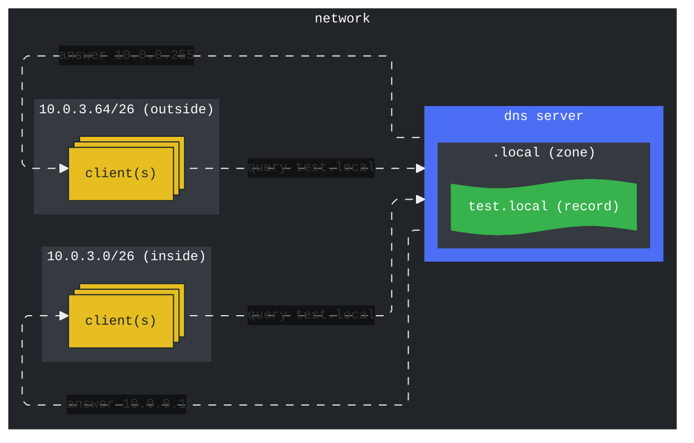

# active-directory-dns-policy-demo

PowerShell script to setup a demo of Active Directory DNS resolution policies

## Overview

This script configures Active Directory DNS resolution policies for
demonstration purposes. The script creates a DNS zone and then creates "inside"
and "outside" DNS client subnets, zone scopes, and query resolution policies.
The script then creates a DNS record named "test" in each zone scope that points
to a different IP address.



To demonstrate the effect of the DNS resolution policies, query the "test"
record from clients in the "inside" and "outside" subnets and confirm different
answers are returned.

## Requirements

+ Active Directory domain with DNS
+ DNS clients in inside and outside subnets

## Usage

```pwsh
.\dns-policy.ps1 -ZoneName 'local' -InsideSubnetCidr '10.0.3.0/26' -OutsideSubnetCidr '10.0.3.64/26'
```

## Useful documentation

[DNS Policies Overview](https://learn.microsoft.com/en-us/windows-server/networking/dns/deploy/dns-policies-overview)
